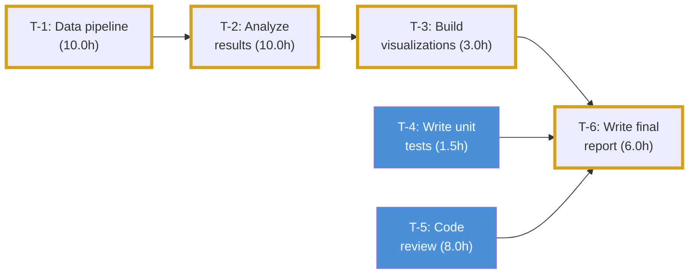

# DAGr

**DAG-powered project scheduler for the command line.**

Plan tasks, declare dependencies, and let the critical path algorithm tell you what matters most. DAGr schedules in working hours (not wall-clock), handles background jobs, and gives you a realistic single-person timeline.


<sub>Critical path in gold. Tasks with slack in blue.</sub>

## Use Cases

- **Research & thesis projects** -- multi-week lab work with compute pipelines and advisor deadlines
- **Software releases** -- feature work, testing, code review, and deployment with hard ship dates
- **Course planning** -- assignments, readings, and exams with overlapping deadlines
- **Any solo project** where tasks have dependencies and you need to know what to work on next

## Installation

Requires Python 3.13+. Install with [uv](https://docs.astral.sh/uv/):

```bash
uv venv && uv pip install -e .
```

This makes the `dagr` command available in your virtualenv. Activate it with `source .venv/bin/activate`, or run commands directly via `.venv/bin/dagr`.

## Quick Start

### 1. Initialize your project

Set your project start date and working hours:

```bash
dagr init --start 2026-02-23
```

This defaults to 8-hour work days starting at 9:00 AM, skipping weekends. Customize with:

```bash
dagr init --start 2026-02-23 --hours-per-day 6 --day-start 10:00 --no-skip-weekends
```

### 2. Add tasks

```bash
dagr add "Data pipeline" --duration 10 --bg
dagr add "Analyze results" --duration 10 --depends T-1
dagr add "Build visualizations" --duration 3 --depends T-2
dagr add "Write unit tests" --duration 1.5
dagr add "Code review" --duration 8
dagr add "Write final report" --duration 6 --depends T-3,T-4,T-5 --deadline 2026-03-02
```

Each task gets an auto-generated ID (`T-1`, `T-2`, ...).

- `--depends T-1,T-2,T-3` — this task can't start until those finish (comma-separated or repeat the flag). Dependencies are validated at add time — a typo like `--depends T-l` will be caught immediately.
- `--deadline 2026-03-02` — hard due date. Deadlines constrain the backward pass, so upstream tasks get reduced slack and may join the critical path. Tasks that overshoot their deadline show negative slack and are flagged LATE.
- `--start 2026-02-25` — earliest date work can begin (e.g., waiting on access)
- `--bg` — marks a task as **background** (runs unattended, like a compute pipeline)
- `--project life` — categorizes the task (defaults to `thesis`)
- `--flex` — marks a task as **flexible**. Flexible tasks bypass the constraints of the normal critical path calculation and run parallel to the schedule without delaying your project timeline. Perfect for chores or side-quests.
- `--tag errands` — add context tags (like energy levels or categories). Can provide multiple tags.
- `--notes "some text"` — attach markdown notes to a task (visible in `dagr show`)

### 3. View your schedule

```bash
dagr schedule
```

Outputs a table showing each task's computed start/end times (respecting working hours and weekends), slack, and flags:

- **CRITICAL** — on the critical path (zero or negative slack; any delay here delays everything)
- **LATE** — projected to finish after its deadline (shown with negative slack)

```
                              Schedule
┏━━━━━━┳━━━━━━━━━━━━━━━━━━━━━━━┳━━━━━━━┳━━━━━━━━━━━━━┳━━━━━━━━━━━━━━━┳━━━━━━━━━━━━━━━┳━━━━━━━┳━━━━━━━━━━━━┳━━━━━━━━━━┓
┃ ID   ┃ Task Name             ┃ Hours ┃ Status      ┃ Start         ┃ End           ┃ Slack ┃ Deadline   ┃ Flags    ┃
┡━━━━━━╇━━━━━━━━━━━━━━━━━━━━━━━╇━━━━━━━╇━━━━━━━━━━━━━╇━━━━━━━━━━━━━━━╇━━━━━━━━━━━━━━━╇━━━━━━━╇━━━━━━━━━━━━╇━━━━━━━━━━┩
│ T-1  │ Data pipeline         │  10.0 │ not_started │ Feb 23, 09:00 │ Feb 24, 11:00 │   0.0 │ -          │ CRITICAL │
│ T-2  │ Analyze results       │  10.0 │ not_started │ Feb 24, 11:00 │ Feb 25, 13:00 │   0.0 │ -          │ CRITICAL │
│ T-3  │ Build visualizations  │   3.0 │ not_started │ Feb 25, 13:00 │ Feb 25, 16:00 │   0.0 │ -          │ CRITICAL │
│ T-4  │ Write unit tests      │   1.5 │ not_started │ Feb 23, 09:00 │ Feb 23, 10:30 │  21.5 │ -          │ -        │
│ T-5  │ Code review           │   8.0 │ not_started │ Feb 23, 09:00 │ Feb 23, 17:00 │  15.0 │ -          │ -        │
│ T-6  │ Write final report    │   6.0 │ not_started │ Feb 25, 16:00 │ Feb 26, 14:00 │   0.0 │ 2026-03-02 │ CRITICAL │
└──────┴───────────────────────┴───────┴─────────────┴───────────────┴───────────────┴───────┴────────────┴──────────┘
```

### 4. See your daily plan

```bash
dagr daily
```

Shows a realistic day-by-day breakdown with tasks serialized for a single person. The resource leveler schedules one task at a time, always picking the most critical (lowest slack) ready task next. Background tasks run in parallel and don't block your hands-on work.

```bash
dagr daily -n 5    # show only the next 5 working days
```

Each day shows:
- Attended work hours and background hours separately
- Time blocks for each task
- **CRIT** flag for critical path tasks
- **BG** flag for background tasks

```
Mon Feb 23  (8.0h + 8.0h background)
Time         ID    Task                Hours
09:00-17:00  T-5   Code review         8.0h
09:00-17:00  T-1   Data pipeline       8.0h  CRIT BG

Tue Feb 24  (8.0h + 2.0h background)
Time         ID    Task                Hours
09:00-10:30  T-4   Write unit tests    1.5h
10:30-17:00  T-2   Analyze results     6.5h  CRIT
09:00-11:00  T-1   Data pipeline       2.0h  CRIT BG

Wed Feb 25  (8.0h)
Time         ID    Task                   Hours
09:00-12:30  T-2   Analyze results        3.5h  CRIT
12:30-15:30  T-3   Build visualizations   3.0h  CRIT
15:30-17:00  T-6   Write final report     1.5h  CRIT
```

### 5. Track progress

When you start working on a task:

```bash
dagr start T-1
```

When you finish it:

```bash
dagr done T-1
```

These record actual timestamps. When you complete a task, DAGr shows how your actual time compared to the estimate:

```
Completed T-1 at 2026-02-24T15:30:00
  Estimated: 10.0h  Actual: 12.5h  +2.5h over
```

If you skip `dagr start` and go straight to `dagr done`, DAGr warns you that actual time can't be measured (since there's no start timestamp to compare against).

The scheduler uses real completion times for finished tasks instead of estimates, so downstream projections get more accurate as you go.

Made a mistake? Reset a task back to not-started:

```bash
dagr reset T-1
```

Need to reopen a completed task or pause one that's in progress? Use `set-status` to override a task's status directly:

```bash
dagr set-status T-1 in_progress   # reopen a done task (preserves actual_start)
dagr set-status T-2 not_started   # pause an in-progress task (clears timestamps)
```

This is the escape hatch for when life doesn't follow the `start` → `done` happy path — e.g. you started T-2 but realized T-1 needs rework, so you need to reopen T-1 and pause T-2.

### 6. Adapt as things change

Update a task's duration when reality doesn't match the estimate:

```bash
dagr update T-2 --duration 15
```

All downstream tasks automatically recalculate. Add or remove dependencies after the fact:

```bash
dagr update T-6 --add-dep T-10       # T-6 now waits for T-10
dagr update T-6 --remove-dep T-3     # T-6 no longer waits for T-3
```

Mark a task as background if it runs unattended:

```bash
dagr update T-5 --bg       # mark as background
dagr update T-5 --no-bg    # revert to attended
dagr update T-6 --notes "Include executive summary and appendix"
```

View all details for a specific task:

```bash
dagr show T-1
```

```
T-1  Data pipeline
  Status:     in_progress
  Duration:   10.0h
  Background: yes
  Depends on: —
  Blocks:     T-2

  ── Scheduled ──
  Earliest start:  Mon Feb 23, 09:00
  Earliest finish: Tue Feb 24, 11:00
  Latest start:    Mon Feb 23, 09:00
  Latest finish:   Tue Feb 24, 11:00
  Slack:           0.0h
  On the critical path
```

Filter the task list:

```bash
dagr list --status not_started       # only not-started tasks
dagr list --search "review"          # search by name
dagr list -s done -q "pipeline"      # combine filters
dagr list --project life             # show flexible/side tasks only
dagr list --tag low-energy           # filter by context tag
```

### 7. Bulk import tasks

Got a list of tasks from a meeting, a planning doc, or an LLM? Import them all at once:

```json
{
  "tasks": [
    {"name": "Design API schema", "duration_hrs": 4},
    {"name": "Implement endpoints", "duration_hrs": 8, "depends_on": ["Design API schema"]},
    {"name": "Write tests", "duration_hrs": 3, "depends_on": ["Implement endpoints", "T-5"]}
  ]
}
```

```bash
dagr import tasks.json                    # import from file
cat tasks.json | dagr import -            # import from stdin
dagr import tasks.json --dry-run          # preview without saving
```

Dependencies can reference existing task IDs (`T-5`) or names of other tasks in the same import batch (`Design API schema`). To update an existing task instead of creating a new one, include its `"id"` field.

Each task supports all the usual fields: `depends_on`, `deadline`, `proposed_start`, `background`, `notes`.

### 8. Check project health

```bash
dagr status
```

Shows a dashboard with tasks done/remaining, hours completed, a progress bar, projected completion date, and any tasks at risk of missing their deadline. The projected completion uses the resource-leveled (single-person) schedule, so it reflects when you'll realistically finish -- not an optimistic parallel estimate.

```
Project Status

  Tasks:  2 done  1 in progress  3 remaining  (6 total)
  Hours:  11.5h done  27.0h remaining  (38.5h total)
  Progress: █████████░░░░░░░░░░░░░░░░░░░░░░ 30%
  Projected completion: Thu Feb 26, 2026

  ⚠ 1 task(s) projected LATE:
    T-6 Write final report — deadline 2026-03-02, projected Mar 04

  Critical path: 4 tasks, 29.0h total
```

### 9. Morning briefing

```bash
dagr today
```

One command to start your day. Shows your progress, any late warnings, background jobs to kick off, today's task schedule, and what to start next.

```
Good morning!

  █████████░░░░░░░░░░░░░░░░░░░░░░ 30%  (2/6 tasks, 27.0h remaining)
  Projected completion: Thu Feb 26, 2026

Kick off background jobs
  T-1  Data pipeline  (10.0h)  CRIT

Today's schedule
  Time         ID    Task            Hours
  09:00-17:00  T-5   Code review     8.0h

  Run dagr start T-5 to begin.
```

### 10. What should I work on? (The Dopamine Menu)

```bash
dagr next
```

Shows the single most important task to work on right now (lowest slack, highest urgency). Also surfaces any background jobs that are ready to kick off. If a task is already in progress, it reminds you of that instead.

Critically, if you have **flexible tasks** (tagged with `--flex`) that are ready, `dagr next` will also serve a **⚡ Dopamine Menu**. This organizes alternative, low-friction tasks into explicit categories based on their tags or duration:
- **🏃 Quick Wins**: Tasks < 1 hour or tagged `quick`.
- **🔋 Low Energy**: Tasks tagged `low-energy` or `braindead`.
- **🧠 Hyperfocus**: Tasks tagged `hyperfocus` or `deep-work`.
- **🗺️ Other Side Quests**: All other flexible tasks.

```
Kick off background job(s) first:
  T-1  Data pipeline  (10.0h)  CRIT

  ⚡ Dopamine Menu (Flexible Tasks)

  🏃 Quick Wins
    T-14  Respond to email  (0.2h, life)
  
  🔋 Low Energy
    T-90  Laundry           (1.0h, chores)

  Next up (Critical Path):
  T-5  Code review  (8.0h)
  Projected start: Mon Feb 23, 09:00

  Run dagr start T-5 to begin.
```

### 11. Elastic Days

Life happens. Need a day off, or plan to hyperfocus and squeeze in extra hours? You can override your default working hours for any specific date using `dagr capacity`:

```bash
dagr capacity 2026-03-05 0.0    # Take the day off (0 hours)
dagr capacity 2026-03-06 12.0   # Plan a 12-hour hyperfocus session
```

The scheduler (and all commands like `dagr today` and `dagr daily`) will automatically adjust and flow your tasks through these custom capacity days. Even if you configured the project to skip weekends, you can still add capacity to a Saturday to schedule catch-up work!

### 12. Export for sharing

```bash
dagr schedule --csv schedule.csv           # full schedule to CSV
dagr schedule --remaining --csv todo.csv   # only remaining tasks
```

## All Commands

| Command | Description |
|---|---|
| `dagr init` | Set project start date and working hours config |
| `dagr add` | Add a new task (`-d`, `--depends`, `--deadline`, `--start`, `--bg`, `--project`, `--flex`, `--notes`) |
| `dagr list` | Show all tasks (`--status`, `--search`, `--project` to filter) |
| `dagr update <ID>` | Update task fields (deps, duration, status, project, flex, etc.) |
| `dagr delete <ID>` | Remove a task and clean up dependency references |
| `dagr show <ID>` | View all details for a task (deps, schedule, slack) |
| `dagr start <ID>` | Mark a task as in-progress (records timestamp) |
| `dagr done <ID>` | Mark a task as completed (shows actual vs estimated time) |
| `dagr reset <ID>` | Reset a task back to not_started (undo start/done) |
| `dagr set-status <ID> <STATUS>` | Override a task's status directly (reopen, pause, etc.) |
| `dagr import <FILE>` | Bulk import tasks from JSON (`-` for stdin, `--dry-run` to preview) |
| `dagr schedule` | Full schedule table (`--remaining` to hide done, `--csv` to export) |
| `dagr critical-path` | Show critical path tasks (`--sort chrono`, `--sort chain`) |
| `dagr status` | Project health dashboard (progress, deadlines, critical path) |
| `dagr next` | Show the single next task you should work on |
| `dagr today` | Morning briefing: status + today's tasks + what to do next |
| `dagr daily` | Day-by-day plan, serialized for one person (`-n` for day count) |
| `dagr capacity <DATE> <HOURS>` | Override working hours for a specific day |
| `dagr viz` | Generate a Mermaid flowchart of the DAG (`-o`, `--hide-done`) |
| `dagr viz-html` | Generate an interactive PyVis HTML flowchart (`-o`, `--hide-done`) |

Run `dagr <command> --help` for detailed options on any command.

## How It Works

### The DAG

Tasks are **nodes** in a directed graph. Dependencies are **edges**. A topological sort determines a valid execution order where no task starts before its prerequisites finish.

### Working Hours Model

Time is measured in **working hours**, not wall-clock hours. A 10-hour task starting Friday at 3 PM doesn't end at 1 AM Saturday -- it ends Tuesday at 1 PM (assuming 8h days, weekends skipped). This makes projected dates realistic.

### Critical Path Analysis

The scheduler runs a **forward pass** (earliest start/finish for each task) and a **backward pass** (latest start/finish without delaying the project). The difference is **slack** -- how much a task can slip without affecting the end date. Tasks with zero or negative slack form the **critical path**: the longest chain of dependencies that determines total project duration.

**Deadlines constrain the backward pass.** When a task has a deadline, its latest finish is capped at that deadline, and the constraint propagates backward to all upstream tasks. This means tasks feeding into a deadline get reduced slack and may become critical even if they wouldn't be otherwise.

**Negative slack** means a task chain is already behind its deadline. For example, `-3.0h` slack means you'd need to find 3 hours of savings to meet the deadline. Use `dagr critical-path --sort chain` to see independent critical chains grouped separately, or `--sort chrono` to sort by start time.

**Multiple Critical Paths**: DAGr natively handles multiple parallel projects (like a thesis vs. remodeling a bedroom) because the "critical path" is just any task chain with zero or negative slack. If you give independent goals hard deadlines, they will form separate critical paths that dynamically compete for your time. The scheduler evaluates all active paths simultaneously and will auto-switch your focus to whichever project's deadline makes it the most urgent off that day.

### Resource Leveling

`dagr schedule` shows the *unconstrained* schedule (unlimited parallelism), useful for slack and critical path analysis. `dagr daily` applies **resource leveling** for a single person: independent tasks are serialized, with the most critical (lowest slack) task scheduled first. Background tasks bypass this constraint and run in parallel.

### Background Tasks

Some tasks run unattended (compute pipelines, CI builds, overnight renders). Mark them with `--bg` and the resource leveler will schedule other hands-on work alongside them. Downstream tasks that depend on a background task still wait for it to finish.

### Persistence

Everything is stored in a single `dagr.json` file in the working directory. The file is human-readable and can be version-controlled if needed.

## Visualize the DAG

```bash
dagr viz                    # full DAG to dag.md (Mermaid)
dagr viz --hide-done        # only remaining tasks
dagr viz -o my-graph.md     # custom output file
dagr viz-html               # interactive HTML diagram (PyVis)
dagr viz-html -o my-dag.html
```

Color-coded nodes:
- **Green** -- done
- **Orange** -- in progress
- **Tan with thick border** -- critical path
- **Blue** -- default

The Mermaid output (`dagr viz`) can be previewed in VS Code with Markdown Preview (`Cmd+Shift+V`) or rendered natively by GitHub. The HTML output (`dagr viz-html`) opens in any browser with interactive dragging and zooming.

## MCP Server (AI Integration)

DAGr includes an MCP (Model Context Protocol) server that lets AI assistants like Claude Code, Claude Desktop, or Cursor manage your tasks directly in conversation.

### Setup

```bash
# Install with MCP support
uv pip install -e .

# Register with Claude Code
claude mcp add dagr -- dagr-mcp
```

Or without installing globally:

```bash
claude mcp add dagr -- uv run --directory /path/to/DAGr dagr-mcp
```

### What it enables

Once registered, your AI assistant can:

- **"Here are my meeting notes, add the tasks to DAGr"** -- the AI creates tasks directly
- **"What should I work on?"** -- the AI checks your schedule and gives context-aware advice
- **"I finished T-21, mark it done"** -- status updates mid-conversation
- **"How's my project looking?"** -- the AI reads your dashboard and reasons about your timeline

### Available tools

| Tool | Description |
|------|-------------|
| `add_task` | Create a new task |
| `update_task` | Modify task fields |
| `delete_task` | Remove a task |
| `start_task` | Mark as in-progress |
| `complete_task` | Mark as done |
| `set_task_status` | Override status directly |
| `import_tasks` | Bulk add/update tasks |
| `get_task` | Details for one task |
| `list_tasks` | List with optional filters |
| `get_schedule` | Full schedule with slack/critical path |
| `get_status` | Project health dashboard |
| `get_next_task` | What to work on next |
| `get_critical_path` | Critical path analysis |

## The Workflow

1. **Brain dump** -- Add all your tasks with rough hour estimates
2. **Link** -- Declare dependencies between tasks
3. **Plan** -- Run `dagr daily` to see your realistic day-by-day plan
4. **Execute** -- Use `dagr start` and `dagr done` as you work
5. **Adapt** -- When estimates are wrong, `dagr update` the duration and re-check
